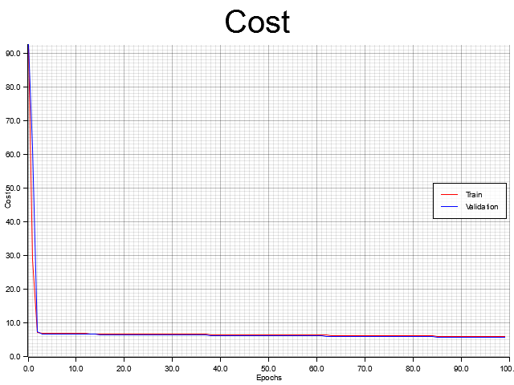
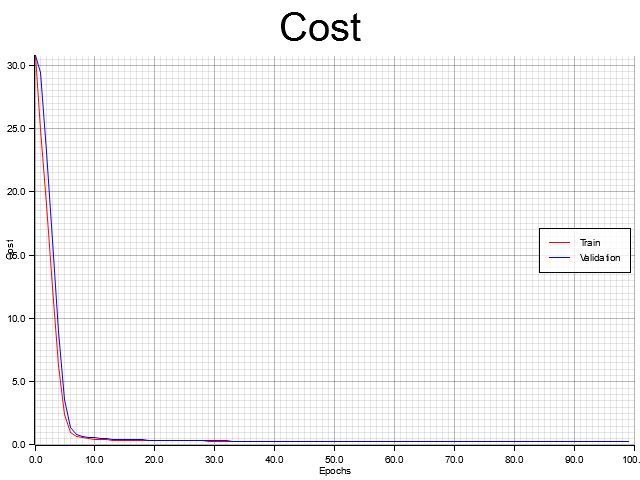
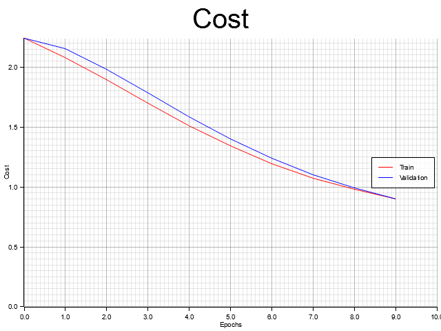

# Rust Neural Network (rust-nn)

A from-scratch implementation of a neural network library in Rust, including a custom matrix math library and a data processing utility.

This is just a project for learning. There is no real/significant optimization in place. The "vectorization" is still just a for loop.

## Project Structure

This workspace consists of three main crates:

- **`matrix`**: A low-level linear algebra library providing the `Matrix` struct and essential operations.
- **`neural-network`**: A high-level library for building, training, and evaluating neural networks. This uses the matrix library.
- **`playground`**: A collection of examples showcasing the neural network in different problems.
The only dependency for **matrix** and **neural-network** is the **rand** crate.

## Features

### Matrix Library (`matrix`)
- Matrix operations: `add`, `subtract`, `multiply_elementwise`, `divide_elementwise`.
- Matrix multiplication (`matmul`) and `transpose`.
- Reductions: `sum`, `max`, `min` (supports global and axis-wise operations).
- Broadcasting: `broadcast_cols` and `broadcast_rows` for flexible arithmetic.
- Randomized initialization with range support.

### Neural Network Library (`neural-network`)
- **Flexible Architecture**: Create networks with any number of layers and neurons.
- **Activation Functions**:
  - `SIGMOID`
  - `RELU`
  - `LINEAR`
- **Loss Functions**:
  - `MSE` (Mean Squared Error)
  - `LOGISTIC` (Binary Cross-Entropy) with numerical stability clipping.
- **Training**:
  - Backpropagation with automated gradient calculation.
  - Gradient Descent optimizer.
  - Batch training support.
- **Data Utilities**:
  - CSV parsing and processing.
  - One-hot encoding for categorical features.
  - Data splitting (train/test) and batching.

## Examples

The `playground` crate contains several examples demonstrating the library's capabilities on real-world datasets.

### Abalone Age Prediction
Predicts the age of abalone (number of rings) from physical measurements like length, diameter, and weight.
- **Architecture**: `[10, 64, 64, 1]` with `RELU` and `LINEAR` activations.
- **Loss Function**: `MSE` (Mean Squared Error).
- **Preprocessing**: One-hot encoding for categorical features and min-max scaling for continuous features.

Achieved Test Cost: 6.283496242342301

### Fuel Efficiency Prediction
Predicts the fuel efficiency (MPG) of various car models based on attributes like cylinders, displacement, and weight.
- **Architecture**: `[8, 64, 64, 1]` with `RELU` and `LINEAR` activations.
- **Loss Function**: `MSE`.
- **Preprocessing**: Mean normalization and min-max scaling.

Achieved Test Cost: 0.3197017785268062

### MNIST Digit Classification
The classic MNIST dataset for classifying handwritten digits (0-9).
- **Architecture**: `[784, 128, 10]` with `RELU` and `SOFTMAX` activations.
- **Loss Function**: `SPARSE_CATEGORICAL_CROSSENTROPY`.
- **Preprocessing**: Pixel value normalization (0-1).

Achieved Test Accuracy: 0.8346 (Cost: 0.8359729594421659)

Note: The dataset is not included as the file is too big.

